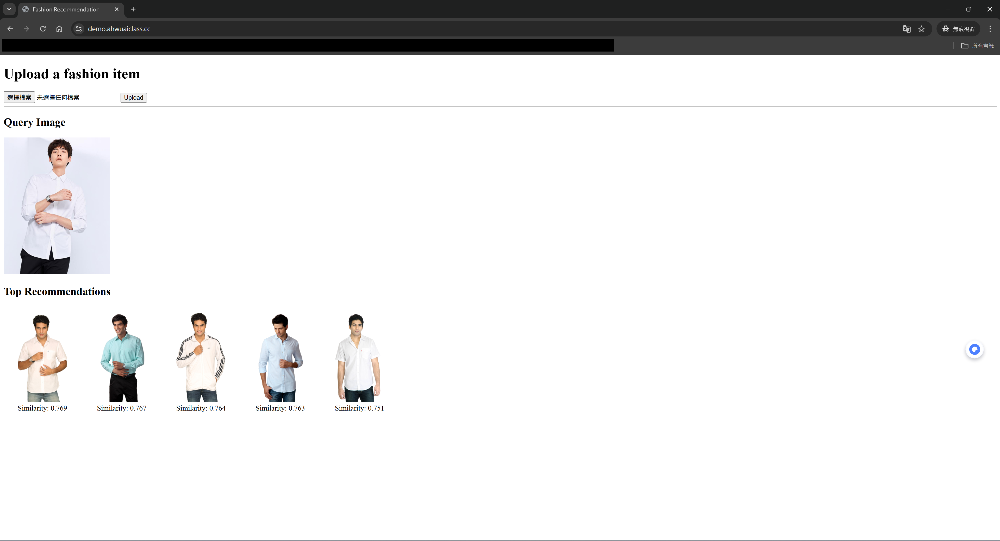

# 👗 AI-Powered Clothing Image Recommendation System

This is a Flask-based web application that recommends similar clothing items based on an uploaded image. It uses a pre-trained ResNet model to extract image embeddings and computes similarity using cosine distance.

---

## 🔧 Features

* Extracts image embeddings using ResNet50V2.
* Calculates cosine similarity between uploaded image and database images.
* Displays top 5 visually similar clothing items on a web interface.

---

## 📁 Project Structure

```
.
├── app.py                     # Main Flask application
├── predict.py                 # Embedding extraction using ResNet
├── embeddings.npy             # Pre-computed embeddings for image dataset
├── image_paths.npy            # Corresponding paths for dataset images
├── static/
│   ├── images/                # Clothing image dataset
│   ├── uploads/               # Uploaded user images
│   └── recommend/             # Copied recommended images
└── templates/
    └── index.html             # HTML interface
```

---

## ▶️ How to Use

### 1. Install Dependencies

```bash
pip install flask numpy opencv-python scikit-learn
```

### 2. Prepare Folders

Make sure the following directories exist:

```bash
mkdir -p static/uploads static/recommend static/images
```

Add your clothing images to `static/images/`, then run a script (e.g. `generate_embeddings.py`) to generate the following files:

* `embeddings.npy`: N x D matrix of feature vectors
* `image_paths.npy`: Paths matching each vector (e.g., `images/123.jpg`)


### 3. Start the Server

```bash
python app.py
```

By default, the web app will be hosted at:
[http://localhost:5000](http://localhost:5000)

---

## 🌟 How It Works

1. User uploads a clothing image on the homepage.
2. The image is processed and converted into a feature vector.
3. Cosine similarity is calculated between the uploaded image and all dataset images.
4. Top 5 most similar images are displayed with similarity scores.

---

## 🧠 Model & Similarity

* **Model**: ResNet50V2 (from Keras Applications)
* **Similarity Metric**: Cosine similarity (using `sklearn.metrics.pairwise`)

---

## ⚠️ Notes

* Supported image format: `.jpg`
* Make sure the paths in `image_paths.npy` match images inside `static/images/`
* Uploaded and recommended images are saved in `static/uploads` and `static/recommend`

---


Refer:
[Building a Recommendation System Using CNN - v2](https://www.kaggle.com/code/marlesson/building-a-recommendation-system-using-cnn-v2)